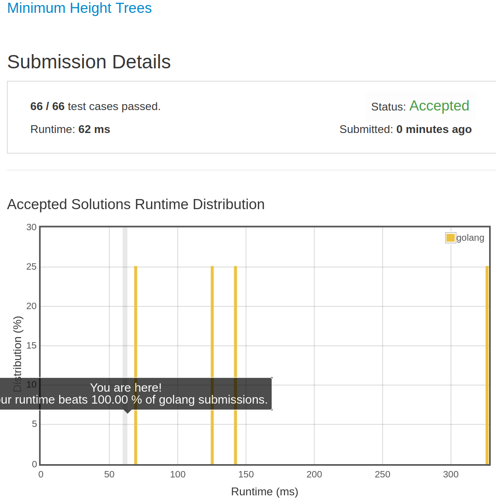

# [310. Minimum Height Trees](https://leetcode.com/problems/minimum-height-trees/)

## 题目

For a undirected graph with tree characteristics, we can choose any node as the root. The result graph is then a rooted tree. Among all possible rooted trees, those with minimum height are called minimum height trees (MHTs).
Given such a graph, write a function to find all the MHTs and return a list of their root labels.

Format

The graph contains n nodes which are labeled from 0 to n - 1.
You will be given the number n and a list of undirected edges (each edge is a pair of labels).

You can assume that no duplicate edges will appear in edges. Since all edges are undirected, [0, 1] is the same as [1, 0] and thus will not appear together in edges.

Example 1:

```shell
Given n = 4, edges = [[1, 0], [1, 2], [1, 3]]

        0
        |
        1
       / \
      2   3

return  [1]
```

Example 2:

```shell
Given n = 6, edges = [[0, 3], [1, 3], [2, 3], [4, 3], [5, 4]]

     0  1  2
      \ | /
        3
        |
        4
        |
        5

return  [3, 4]
```

Note:

1. According to the definition of tree on Wikipedia: “a tree is an undirected graph in which any two vertices are connected by  exactly one path. In other words, any connected graph without simple cycles is a tree.”
1. The height of a rooted tree is the number of edges on the longest downward path between the root and a leaf.

Credits:Special thanks to @dietpepsi for adding this problem and creating all test cases.

## 解题思路

见程序注释

